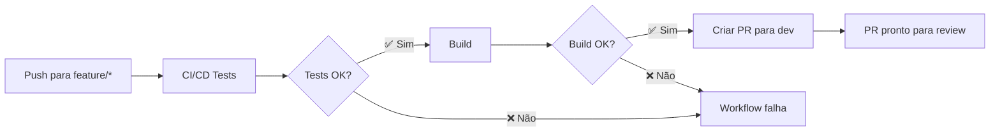

# Auto Pull Request para Dev

## 🚀 Funcionalidade: Criação Automática de PR

Após build e testes passarem com sucesso, o workflow cria automaticamente um Pull Request para a branch `dev`.

## 🔧 Como Funciona

### ✅ **Condições para Criação do PR:**
1. ✅ Todos os testes passaram
2. ✅ Build executado com sucesso  
3. ✅ Evento é um `push` (não PR)
4. ✅ Branch não é `dev`, `develop`, `main` ou `master`

### 🎯 **Quando o PR é Criado:**
```bash
# Exemplos de branches que criarão PR automático:
git push origin feature/nova-funcionalidade  # ✅ Cria PR
git push origin fix/correcao-bug             # ✅ Cria PR
git push origin hotfix/urgente               # ✅ Cria PR
git push origin minha-branch-personalizada   # ✅ Cria PR

# Branches que NÃO criam PR automático:
git push origin dev        # ❌ Não cria (é o destino)
git push origin main       # ❌ Bloqueado + não cria
```

## 📋 **Detalhes do PR Criado**

### Título:
```
🚀 Auto PR: [nome-da-branch] → dev
```

### Conteúdo:
```markdown
## 🚀 Pull Request Automático para Dev

**Branch de origem:** nome-da-branch
**Branch de destino:** dev
**Commit:** abc123...

### ✅ Validações Passaram
- ✅ Testes executados com sucesso
- ✅ Build realizado com sucesso
- ✅ Validações de qualidade aprovadas

### 📋 Resumo das Alterações
Este PR foi criado automaticamente após todos os testes e builds 
passarem com sucesso na branch nome-da-branch.

### 🔍 Próximos Passos
1. Revisar as alterações propostas
2. Executar testes adicionais se necessário
3. Aprovar e fazer merge para dev
```

### Labels Automáticas:
- `auto-pr` - Identifica como PR automático
- `ready-for-review` - Indica que está pronto para revisão

## 🌊 **Fluxo de Trabalho Completo**



### Exemplo Prático:
```bash
# 1. Desenvolver em branch feature
git checkout -b feature/login-system
echo "nova funcionalidade" > login.js
git add login.js
git commit -m "Adiciona sistema de login"

# 2. Push dispara workflow
git push origin feature/login-system
# ✅ Testes passam
# ✅ Build passa
# 🚀 PR automático criado: feature/login-system → dev

# 3. Revisar PR no GitHub
# 4. Aprovar e merge para dev
```

## ⚙️ **Configuração Técnica**

### Action Utilizada:
```yaml
- name: Create Pull Request to Dev
  uses: peter-evans/create-pull-request@v5
  with:
    token: ${{ secrets.GITHUB_TOKEN }}
    base: dev
    head: ${{ github.ref_name }}
    title: "🚀 Auto PR: ${{ github.ref_name }} → dev"
    labels: |
      auto-pr
      ready-for-review
    draft: false
```

### Condições:
```yaml
if: success() && 
    github.event_name == 'push' && 
    github.ref != 'refs/heads/dev' && 
    github.ref != 'refs/heads/develop' && 
    github.ref != 'refs/heads/main' && 
    github.ref != 'refs/heads/master'
```

## 🎯 **Benefícios**

- 🚀 **Automação**: Elimina etapa manual de criação de PR
- ⚡ **Rapidez**: PR criado imediatamente após sucesso
- 📊 **Qualidade**: Só cria PR se testes/build passaram
- 🏷️ **Organização**: Labels automáticas para categorização
- 📝 **Documentação**: Template padronizado de PR

## 🔍 **Monitoramento**

Após push bem-sucedido, verifique:
1. ✅ Aba "Actions" - workflow executado
2. ✅ Aba "Pull Requests" - PR criado automaticamente
3. ✅ Labels aplicadas corretamente
4. ✅ Conteúdo do PR preenchido
