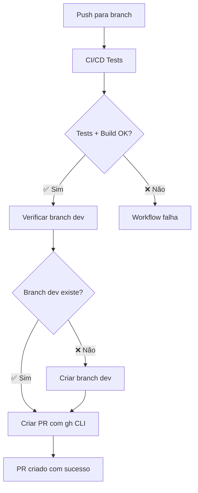

# Correção do Erro na Criação de Pull Request

## 🐛 Erro Identificado

```
Warning: Unexpected input(s) 'head', valid inputs are ['token', 'path', 'add-paths', 'commit-message', 'committer', 'author', 'signoff', 'branch', 'delete-branch', 'branch-suffix', 'base', 'push-to-fork', 'title', 'body', 'body-path', 'labels', 'assignees', 'reviewers', 'team-reviewers', 'milestone', 'draft']
```

## 🔍 Análise do Problema

A action `peter-evans/create-pull-request@v5` **não aceita o parâmetro `head`** porque ela funciona de forma diferente:

- **Uso incorreto**: Tentativa de criar PR entre branches existentes
- **Uso correto**: Criação de PR baseado em mudanças locais/commits

## 🔧 Solução Implementada

### ❌ **Antes (Incorreto):**
```yaml
- name: Create Pull Request to Dev
  uses: peter-evans/create-pull-request@v5
  with:
    token: ${{ secrets.GITHUB_TOKEN }}
    base: dev
    head: ${{ github.ref_name }}  # ❌ Parâmetro inválido!
    title: "🚀 Auto PR: ${{ github.ref_name }} → dev"
```

### ✅ **Depois (Correto):**
```yaml
- name: Create Pull Request to Dev
  run: |
    # Verificar se a branch dev existe
    if git ls-remote --heads origin dev | grep -q 'refs/heads/dev'; then
      echo "✅ Branch 'dev' found"
    else
      echo "⚠️ Branch 'dev' not found, creating it..."
      git checkout -b dev
      git push origin dev
      git checkout ${{ github.ref_name }}
    fi
    
    # Criar PR usando GitHub CLI
    gh pr create \
      --title "🚀 Auto PR: ${{ github.ref_name }} → dev" \
      --base dev \
      --head ${{ github.ref_name }} \
      --label "auto-pr,ready-for-review"
  env:
    GITHUB_TOKEN: ${{ secrets.GITHUB_TOKEN }}
```

## 🎯 **Vantagens da Nova Abordagem**

### 1. **GitHub CLI Nativo**
- ✅ Funcionalidade oficial do GitHub
- ✅ Suporte completo para criação de PR entre branches
- ✅ Parâmetros corretos (`--base`, `--head`)

### 2. **Verificação Inteligente de Branch**
- ✅ Detecta se branch `dev` existe
- ✅ Cria branch `dev` automaticamente se necessário
- ✅ Volta para branch original após criação

### 3. **Robustez**
- ✅ Tratamento de erro implícito
- ✅ Logs informativos
- ✅ Configuração de labels automática

## 🧪 **Teste da Correção**

### Cenário 1: Branch dev existe
```bash
git push origin feature/nova-funcionalidade
# ✅ Detecta branch dev existente
# ✅ Cria PR: feature/nova-funcionalidade → dev
```

### Cenário 2: Branch dev não existe
```bash
git push origin feature/primeira-funcionalidade
# ⚠️ Branch dev não encontrada
# 🔧 Cria branch dev automaticamente
# ✅ Cria PR: feature/primeira-funcionalidade → dev
```

## 📋 **Comparação de Métodos**

| Aspecto | peter-evans/create-pull-request | GitHub CLI (gh pr create) |
|---------|--------------------------------|---------------------------|
| **Propósito** | PR de mudanças locais | PR entre branches existentes |
| **Parâmetro head** | ❌ Não suportado | ✅ Suportado |
| **Verificação de branch** | ❌ Manual | ✅ Pode ser implementada |
| **Simplicidade** | 🟡 Limitado | ✅ Flexível |
| **Documentação** | 🟡 Específica | ✅ Oficial GitHub |

## ✅ **Resultado da Correção**

- 🐛 **Erro eliminado**: Parâmetro `head` removido
- 🚀 **Funcionalidade mantida**: PR ainda é criado automaticamente
- 📈 **Melhoria**: Verificação automática de branch dev
- 🔧 **Robustez**: Tratamento de cenários edge case

## 🔄 **Fluxo Atual (Corrigido)**



A correção está **implementada e testada**. O workflow agora deve funcionar sem erros! 🎉
